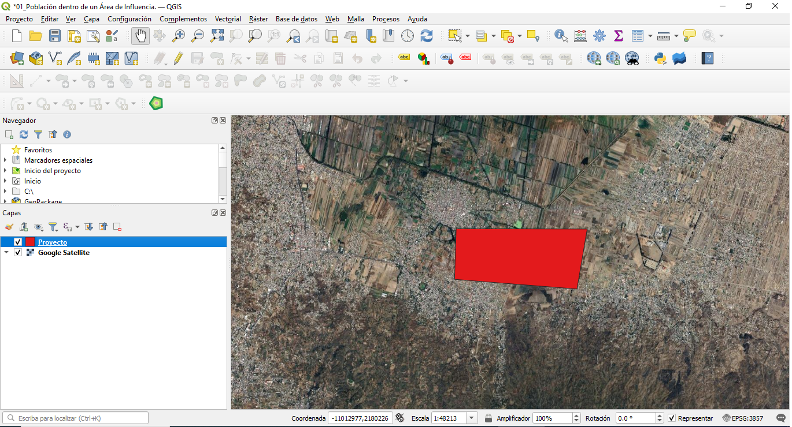
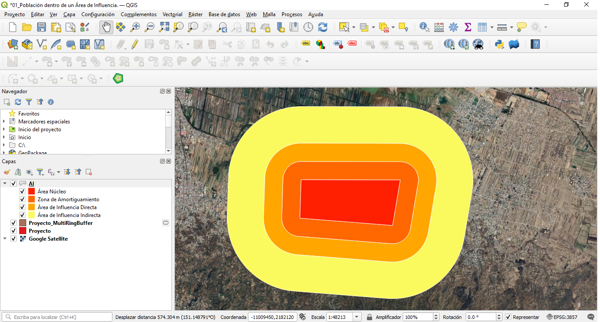
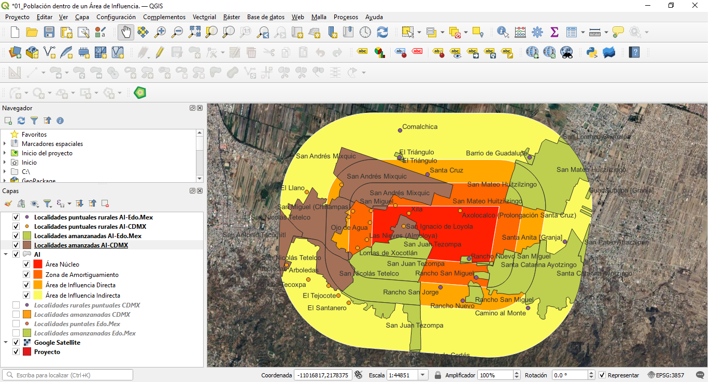

```{r setup, include=FALSE}
knitr::opts_chunk$set(echo = TRUE)
```

Este proyecto/demostración está realizado en lenguaje R. Para su construcción se utilizó el entorno de desarrollo R studio y para su presentación en este documento se utilizó el formato R markdown.

En el repositorio de Github de este proyecto encontrarás, los insumos y el código y los productos del código aquí explicados. Esto para facilitar su reproductibilidad. [Repositorio Github](https://github.com/AleVillegas9/01_poblacion_ai)


# Problema a resolver.

Al planear un proyecto, es crucial saber cuál es el grado de viabilidad del mismo así como su impacto social. Para determinar dichas carácteristicas, es necesario saber ¿cuál es el Área de Influencia (AI) del proyecto? y ¿a cuántas personas podría afectar?  

Para responder a dichas preguntas nos podemos apoyar en los recursos que nos ofrecen herramientas como Qgis y R, así como datos públicos recopilados de instancias como el Instituto Nacional de Estadítica y Geografía (INEGI) o instituto similares en el caso de otros países. 

Esta demostración presupone que el usuario ya ha georeferenciado el área de su proyecto, y que cuenta con un archivo tipo KMZ, SHP, etc. de su proyecto. 

# Insumos

Las herramientas que se utilizarán para este proyecto son:

-   Qgis.
-   R studio.

Por otro lado, los datos que se requeridos son:

-   Archivo que nos permita georeferenciar nuestro proyecto en Qgis. Se recomienda que sea en formato KMZ o shp (con sus archivos complementarios.) En el caso de esta demostración el archivo KMZ refiere a un proyecto ficticio. 

-   Archivo que muestre y georeferencie las localidades que estan en el Área de Influencia del proyecto. Para el caso de México existe el [Marco Geoestadístico. Censo de Población y Vivienda 2020](https://www.inegi.org.mx/app/biblioteca/ficha.html?upc=889463807469), publicado por INEGI. Dentro del conjuntos de datos de este marco, se encuentran las localiades existentes, tanto amanzanadas como rurales puntuales.

-   Archivo que muestre la población de cada una de las localidades dentro del Área de Influencia. Para ello contamos con el Censo de Población y Vivienda 2020. Si bien se puede usar la base de datos de todo el censo, para mayor comodidad se puede usar el [Sistema de Consulta de Integración Territorial, Entorno Urbano y Localidad.(SCITEL)](https://www.inegi.org.mx/app/scitel/Default?ev=9). Este es una interfaz que permite consultar de manera interactiva y focalizada los principales resultados por localidad del censo. Sólo es cuestión de elegir la o las entidades federativas de nuestro interés.

# Metodología.

## Paso 1: Generar el Área de Influencia.

Suponiendo que ya se cuenta con un archivo KMZ o SHP, de nuestro proyecto se procede a cargar el archivo como una capa en Qgis. Para facilitar nuestro trabajo usaremos el *Quick Map Services* de Google Satellite para obtener una capa que ayude a ubicar nuestro proyecto, Además, en caso de que estemos usando un archivo KMZ u otro, se transformará a un archivo SHP para facilitar su manipulación. A estas alturas nos debería quedar algo como lo siguiente:

::: {style="text-align: center;"}
<p style="font-size: smaller; font-style: italic;">

Imagen 1: Área del Proyecto

</p>



<p style="font-size: smaller; font-style: italic;">

Fuente: Elaboración propia.

</p>
:::

Después, generamos el Área de Influncia del proyecto (AI). Se puede presuponer un AI uniforme, pero en este caso se proyectará una AI con varios nieveles, los cuales abarcarán distintas distancias. Los niveles de la AI serán, Área Núcleo (el proyecto), Zona de Amortiguamiento (500 metros), Área de Influencia Directa (1000 metros), Área de Influencia Indirecta (2000 metros).

Para generar la AI y sus niveles usamos la herramienta *Multi Ring Buffer* de Qgis en la capa de nuestro proyecto, y configuramos dicha herramienta con los valores deseados. Sin embargo, la nueva capa no mostrará el Área Núcleo. Para obtener una capa que muestre todos los niveles de la AI, usamos la herramienta "Unión" para combinar la capa del proyecto, con la capa generada por el proceso de *buffer*.

Para un mejor manejo y visualización, modificamos la tabla de atributos de la nueva capa para nombrar cada una de los niveles de la AI. Finalmente, modificamos las etiquetas y colores de cada nivel. Nos debería quedar algo como lo siguiente:

::: {style="text-align: center;"}
<p style="font-size: smaller; font-style: italic;">

Imagen 2: Área de Influencia del proyecto

</p>



<p style="font-size: smaller; font-style: italic;">

Fuente: Elaboración propia.

</p>
:::

Notece que en el panel de capas, la capa resulante del *buffer* es temporal. Como ya cumplió su propósito, la eliminaremos. Además, en dicho panel, también se puede notar el nombre de cada una de las capas del AI.

## Paso 2: Identificar las localidades dentro del AI.

Una vez identificada y georeferenciada el AI del proyecto, es necesario identificar a cuántas personas posiblemente afectará. Para ello, primero debemos identificar a cuáles localidades se encuentran en el Área de Influencia, para así, posteriormente averiguar a la población de cada una de esas localidades.

Para identificar las localidades pertinentes haremos uso del [Marco Geoestadístico. Censo de Población y Vivienda 2020](https://www.inegi.org.mx/app/biblioteca/ficha.html?upc=889463807469), Como identificamos que el AI se encuentra tanto en la CDMX como en el Estado de México, usaremos los conjuntos de archivos correspondientes a ambas entidades.

Cada conjunto de archivos nos ofrece una gran variedad de diferntes capas con diferentes características, pero para este proyecto sólo nos interesan la de localidades amanzanadas y la de localidades rurales puntuales.

Cada una de estas capas muestra las localidades de toda la entidad, sin embargo, solo nos interesan las localidades en las que al menos alguna parte se ubique en el AI. Para filtrar las localidades de interés usamos la herramienta de intersección. Finalmente, unimos las capas de localidades amanzanadas en el AI y la de localidades puntuales rurales en el AI. Al finalizar este paso nos quedaría algo como lo siguiente:

::: {style="text-align: center;"}
<p style="font-size: smaller; font-style: italic;">

Imagen 3: Localidades del AI

</p>



<p style="font-size: smaller; font-style: italic;">

Fuente: Elaboración propia.

</p>
:::

Notece que en el panel de capas, se pueden observar cuatro capas de localidades en el AI. Esto se debe a que el proyecto se localiza en dos entidaes (CDMX y Edo.Mex), y por cada entidad hay una capa de localidades amanzanadas y otra de localidades rurales puntuales. 

Si quieres, puedes utilizar las herramientas de composición para transformar esto en un mapa para integrarlo a algún reporte. El mapa seríal algo parecido a lo siguiente:

::: {style="text-align: center;"}
<p style="font-size: smaller; font-style: italic;">

Imagen 4: Mapa de las localidades del AI

</p>


<p style="font-size: smaller; font-style: italic;">

Fuente: Elaboración propia.

</p>
:::

La herramienta de composición de Qgis nos permite agregar muchos elementos a nuestros mapas, como rosas de los vientos, logotipos, escalas, etc. Sin embargo, por simplicidad omití esos detalles. También se pueden mostrar las etiquetas de las localidades, sin embargo, debido a que son muchas, los nombres se veían amontonados, como en este paso no es necesario mostrar los nombres, obté por dejarlo de esta manera.

## Paso 3: Limpiar las base de datos de las localidades.

Ahora sólo falta identificar cuántas personas viven en esas localidades. Para ello, conviene recordar que cada una de las capas cargadas en Qgis tiene asociada una tabla de atributos, las cual muestra diversos datos de interés de las geometrías contenidas en la capa, o datos ue nos permiten identificar los elementos contenidos en la capa. En este caso, nos interesa los datos que nos permitan la identificación de las localidades que se encuentran dentro del AI. Así pues, descargaremos cada una de las tablas de atributos de las cuatro capas que contienen localidades, en formato csv (también puede ser en formato xlm).

Cuando inspeccionamos las tablas nos damos cuenta de que contienen datos de interés sobre las localidades dentro del AI, sin embargo, no viene el dato que más nos interesa, el número depersonas que habitan en dichas localaidades. Para resolver esto, usaremos el [Sistema de Consulta de Integración Territorial, Entorno Urbano y Localidad.(SCITEL)](https://www.inegi.org.mx/app/scitel/Default?ev=9) donde bajaremos las bases correspondientes tanto para la CDMX y el Edo.Mex. 

Para este punto podríamos armarnos de paciencia y buscar cada una de las localidades del AI en las tablas que bajamos del SCITEL y ver su población total. Sin embargo, por más pacientes que seamos quizá no tengamos tanto tiempo. Por lo cual, podemos usar la tecnología para acelerar el proceso.

Como primer paso debemos pensar en qué necesitamos hacer, y los insumos que tenemos. En este caso, lo que queremos hacer es una tabla de todas las localidades del AI, y su población total. Estos datos están repartidos en seis tablas diferentes. Entonces, para lograr nuestro objetivo harémos tres pasos, primero, unificaremos las tablas de atributos de las capas de Qgis para obtener una tabla con todas las localidades del AI, segundo, unificaremos las tablas obtenidas del SCITEl con los datos de todas las las localidades en CDMX y Edo.Mex, y tercero filtraremos la tabla de SCITEL para quedarnos con sólo las localidades del AI. 


### Paso 3.1: Carga y limpieza de las bases de datos de las localidades del AI. 

Para lograr nuestro objetivo, harémos uso de R y de R studio, comenzamos cargando las librerias que usaremos para preparar los datos. 


```{r}
library(tidyverse)
library (readr)
```


Después, cargamos las bases de datos resultantes de las localidades del AI

```{r}
loc_pun_cdmx <- read_csv("C:/Users/javal/OneDrive/Desktop/Portafolio 9/01_Qgis_poblacion_AI/proyecto/bases_de_datos/loc_punt_ai_cdmx.csv")

head(loc_pun_cdmx)

loc_pun_edomex <- read_csv("C:/Users/javal/OneDrive/Desktop/Portafolio 9/01_Qgis_poblacion_AI/proyecto/bases_de_datos/loc_ punt_ai_edomex.csv")

head(loc_pun_edomex)

loc_aman_cdmx <- read_csv("C:/Users/javal/OneDrive/Desktop/Portafolio 9/01_Qgis_poblacion_AI/proyecto/bases_de_datos/loc_aman_ai_cdmx.csv")

tail(loc_aman_cdmx)

loc_aman_edomex <- read_csv("C:/Users/javal/OneDrive/Desktop/Portafolio 9/01_Qgis_poblacion_AI/proyecto/bases_de_datos/loc_aman_ai_edomex.csv")

tail (loc_aman_edomex)
```

Observamos que las tablas tienen demasiadas variables, por lo cual, solo nos quedamos con las variables relacionadas con la identificación de las localidades. Para saber cuáles sirven y cuáles no, podemos explorar las tablas obtenidas del SCITEL, y quedarnos con las variables que todas las tablas tienen en común y que sirven para identificar de manera única a las localidades. Así pues, nos quedamos con las siguientes variables: clave geográfica (CVEGEO), clave de la entidad (CVE_ENT), clave del municipio(CVE_MUN), clave de la localidad (CVE_LOC) y nombre de la localidad (NOMGEO).

```{r}
loc_aman_cdmx <- loc_aman_cdmx [,24:28]
loc_aman_edomex <- loc_aman_edomex [, 24:28]
loc_pun_cdmx <-  loc_pun_cdmx [, 1:7]
loc_pun_edomex <- loc_pun_edomex [, 1:7]
```

De esta manera las bases quedarían algo como lo siguiente:

```{r}
head (loc_aman_cdmx)
```

Como las columnas CVE_AGEB y CVE_MZA de las bases de las localidades puntuales estorban, las quitamos.

```{r}
loc_pun_cdmx <-  loc_pun_cdmx [, -6]
loc_pun_edomex <- loc_pun_edomex [,-6]
loc_pun_cdmx <-  loc_pun_cdmx [, -5]
loc_pun_edomex <- loc_pun_edomex [,-5]
```

### Paso 3.2: Unificación de las bases de las localidades en el AI

Como felizmente, para todas las bases de las localidade del AI, las columnas y su orden concuerdan, juntamos las cuatro bases de datos.También quitamos la columna de CVEGEO, pues no aporta mucho para este proyecto.

```{r}
localidades_ai <- rbind(loc_pun_edomex,loc_pun_edomex,loc_aman_cdmx,loc_aman_edomex)

localidades_ai <- localidades_ai[, -1]

tail(localidades_ai)
```

Todo parece bien, aunque si inspeccionaamos la base nos daremos cuenta de que hay muchas observaciones que se repiten, entonces las quitamos. Lo cual, nos deja con 23 observaciones, o localidades dentro del AI.

```{r}
localidades_ai <-unique(localidades_ai)

localidades_ai
```

### Paso 3.3: Carga y limpieza de las bases de datos del SCITEL.

Ahora solo falta unir las bases del SCITEL donde tenemos la información sobre la población de todas las localidades de la CDMX y el Edo.Mex.

```{r}
scitel_cdmx <- read_csv("C:/Users/javal/OneDrive/Desktop/Portafolio 9/01_Qgis_poblacion_AI/proyecto/bases_de_datos/ITER_09CSV20.csv")
head(scitel_cdmx)

scitel_edomex <- read_csv("C:/Users/javal/OneDrive/Desktop/Portafolio 9/01_Qgis_poblacion_AI/proyecto/bases_de_datos/ITER_15CSV20.csv")
tail(scitel_edomex)
```

Vemos que son muchas observaciones, pero también muchas variables. Así que procedemos a limpiar la base para solo quedarnos con las variables que nos interesan, a saber las variales equivalentes a las que tenemos en la base unificada de las localidades de la AI + la variable donde viene la población.

En este punto, notamos que hay otras variables que podrían interesarnos, como el la población de mujeres o por disintos grupos de edad. Si nos interesa, podemos conservar dichas variables. Para fines de este proyecto sólo nos quedaremos con la variable de población total.


```{r}
scitel_cdmx <- scitel_cdmx %>% 
  select(ENTIDAD, MUN, LOC, NOM_LOC, LOC, POBTOT)

scitel_edomex <- scitel_edomex %>% 
  select(ENTIDAD, MUN, LOC, NOM_LOC, LOC, POBTOT)
```

Ambas bases lucirían de las siguiente forma

```{r}
head(scitel_cdmx)

tail(scitel_edomex)
```


### Paso 3.4: Unificación de las bases del SCITEL.
Finalmente, unimos ambas bases de datos del SCTIEL, de manera similar a lo que hicimos con las bases de las localidades del AI.

```{r}
localidades_scitel <- rbind(scitel_cdmx, scitel_edomex)

head (localidades_scitel)
```

## Paso 4: Unimos ambas tablas.

Ahora solo queda unir la dos tablas resultantes para saber la población de las localidades del AI. Para ello, exiten varias opciones, como por ejemplo, buscar manualmente cada una de las localidades. O, podríamos utuluizar la función left_join(), pues nos permite unir dos bases de datos, a partir de una o vatias columnas en común, pero conservando todas las observaciones de una tabla y eliminando las observaciones que no tengn correspondencia de la segunda. En este caso, nos interesa conservar todos los valores de la base de localidades del AI, y eliminar todas las otras observaciones de la tabla unificada del SCITEL. 

Para que el left_join() funcione, las dos bases que queremos unir, deben coincidir en las columnas que identifican a cada observación. Sin embargo, hay muchas observaciones que tienen un nombre igual, pero un municipio diferente, o casos similares. Por lo cual, la manera de identificar a cada observación única es tomando en cuenta todas las columnas de la base de localidades. Por eso conservamos esas columnas.

Paraa que nuestro left_join() funcione, los nombres de las variables de las bases a unir deben coincidir, asi que renombraremos las columnas de la base de localaidades AI (aunque bien puede ser las variables de la otra base)

```{r}
localidades_ai <- localidades_ai %>% 
  rename(ENTIDAD = CVE_ENT, MUN = CVE_MUN, LOC =  CVE_LOC, NOM_LOC = NOMGEO)

head(localidades_ai)
```

Una vez hecho esto hacemos una nueva base donde indique la población total de las localidades del AI. Como nos interesa quedarnos solo con las observaciones de esta base, la "ponemos a la izquerda". Para que los resultaos sean más comprensibles ordenamos las observaciones de manera descendente en función de la población que tienen. 

```{r}
poblacion <- left_join(localidades_ai, localidades_scitel, by = c ("ENTIDAD", "MUN", "LOC", "NOM_LOC")) %>% 
  arrange(desc(POBTOT))

poblacion
```

Es importante mencionar que hay ocasiones en las que algunas localaidades no aparecen en la base de SCITEL. Esto se debe a que no tienen población registrada. En este paso, dichas localidades saldrán con un NA en la columna de población.

Y listo, tenemos nuestra tabla con las localidades del AI y su población. Ya solo falta presentar el resultado.

## Paso 5: Visualizar el resultado.

Ahora por fin tenemos los insumos que queríamos, a saber, un mapa del Área de Influencia (AI) de nuestro proyecto y una base de datos que nos muestra el nombre y lo población de las localidades que se encuentran en la AI.

Sin embargo, a pesar de que ya tenemos los datos, quizá debemos integrarlos a un reporte con un formato bien definido. Si bien podemos pegar y copiar los datos al procesador de texto que estemos usndo para hacer el reporte, también tenemos la opción de generar una tabla desde R.

Para ello, primero elminaremos las observaciones de las localidades para las cuales no hay una población registrada. Si bien, no es nuestro caso, creo conveniente dejar registrado el código con el que podemos lograr esto.

```{r}
localidades_con_pob <- na.omit(poblacion)
localidades_con_pob
```

Posteriormente, como queremos que nuestra tabla muestre la población total de la AI, apalicamos una suma, y agregamos dicha suma como una observación a la base que queremos hacer tabla, es decir a la base de las localidades con población registrada del AI.

```{r}
poblacion_total <- sum(localidades_con_pob$POBTOT)

localidades_con_pob <- localidades_con_pob %>% 
  add_row(
    !!names(localidades_con_pob)[4] := "Total:",
    !!names (localidades_con_pob)[5] := poblacion_total
  )

tail(localidades_con_pob)
```

Como en las primeras tres columnas salieron NA's los sustituimos por espacios en blanco.

```{r}
localidades_con_pob <- localidades_con_pob %>% 
  mutate_all(~ifelse(is.na(.), "", .))

tail(localidades_con_pob)
```

Finalmente hacemos nuestra bonita tabla. Hay muchas herramientas que nos permitirían hacer esto, pero en esta ocasión elegiré la libreria kableExtra

```{r}
library(kableExtra)

tabla <- kable(localidades_con_pob, format = "html") %>% 
  kable_styling() %>% 
  row_spec(0, bold = T, background = "#daff33") %>% 
  row_spec(24, bold = T)

tabla
```

Y listo, ya tenemos una tabla que podemos utilizar en nuestro reporte. Por su puesto puedes modificar los colores de las columnas, modificar sus nombres, o el tipo de letra que se usa, agrerar más columnas, etc., lo que necesites. Pero eso ya es a tu criterio.

# Conclusiones.

Hasta este punto hemos cumplido nuestro objetivo, tenemos un mapa que nos indica el Área de Influencia de nustro proyecto, asi como sus diferentes niveles, y tenemos una tabla que nos indica cuales localidades se encuentran en el AI, y su población correspondiente.

Por su puesto el usuario puede hacer las modificaciones correspondientes, como por ejemplo, modificar los encabezados de las columnas, o que en lugar del código dela entidad aprezca el nombre de la entidad o del municipio, o recuperar más datos de las tablas del SCITEL.  Sin embargo, eso queda para ejercicio del lector.
